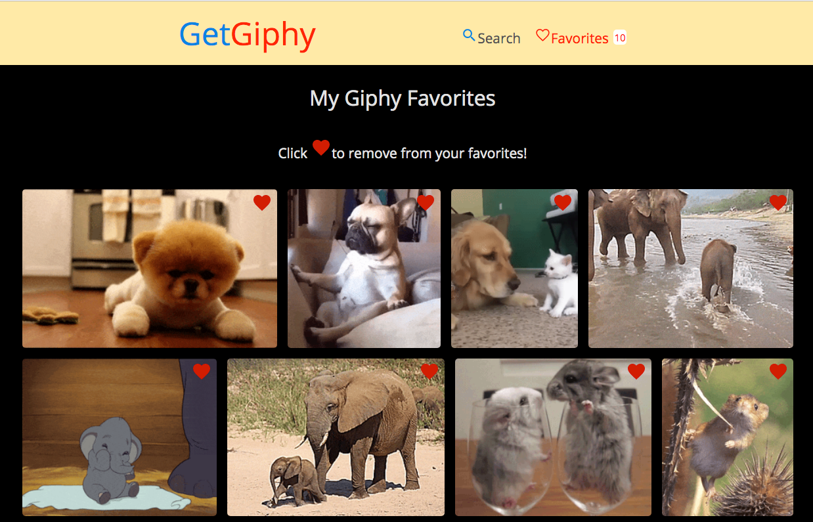

## GetGiphy



### Description

GetGiphy is an app which allows a user to get animated GIFs from the Giphy API and save them to their local Favorites.

### Functionality

This application enables the user to:

- Query Giphy API to retreive animated GIFs.
- Add / Remove GIFs from Favorites

### Install

```
npm i
```

### Run Program

```
npm run start
```

Open site in browser.

`http://localhost:3000/#/`

### Technologies Used

- [React](https://reactjs.org/)
- [React Router](https://reacttraining.com/react-router/) - routing
- [React Context](https://reactjs.org/docs/context.html) - state management
- [Axios](https://www.npmjs.com/package/axios) - fetching API data
- [React Ion Icons](https://zamarrowski.github.io/react-ionicons/) - heart icon
- [React Helmet](https://github.com/nfl/react-helmet) - header meta
- [Eslint](https://eslint.org/) - linting
- [Prettier](https://prettier.io/) - code formatting
- [BEM](http://getbem.com/introduction/) - CSS naming methodoloy
- **Local storage** - to persist Favorites on hard refresh. Database seemed to be overkill for this use case.

### Developer Notes

- Accessibility Features (?)
- SEO
